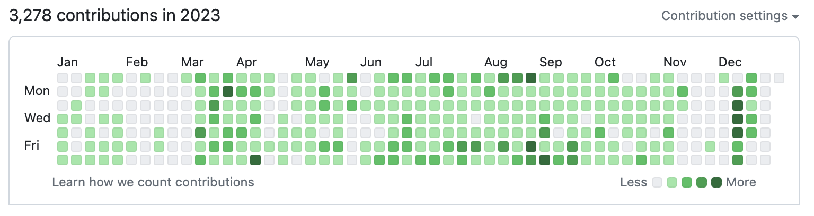

# A novel approach to state management in React

---

# About Me

Matt Riley, Principal Consultant at Thoughtworks
matt.riley@thoughtworks.com / m@ttriley.net

☀️ Tech leader by day  
🌒 Obsessed coder by night 


Most of my side projects double as experiments in software design.

---

# State Management in React

Every team using React seems to be having the same perpetual debate.

**Redux** is overly complicated and usually overkill. (But somehow ends up being the default state management solution, how's that?!)

> Not all apps need Redux. It's important to understand the kind of application you're building, the kinds of problems that you need to solve, and what tools can best solve the problems you're facing.
https://redux.js.org/faq/general#when-should-i-use-redux

**Context** has its own trade-offs (out of scope for this presentation).

Plus an endless number of alternative and emerging solutions.

There's no perfect solution.

---

# Prop-drilling

No-one likes it.

It's a pain having to pass props through each layer of the component hierarchy.

It's actually an antipattern known as Tramp data.

It's a bit like (exactly like) what you'd need to do if you were using only static methods in an OO language. But instead of props we'd call them parameters or arguments.

Who even does that?

---

# React developers do that :/

A React component is a function. Props are an argument to that function.

```js
const SayHello = props => <div>Hello {props.name}</div>;
const element = <SayHello name="World" />;
```

Modern React does without classes. React components are much like static functions.

This one-dimensionality limits how we deal with dependency and lifecycle management.

Prop-drilling is a symptom of idomatic React and JSX compelling us to trade-off good dependency and lifecycle management, and for what?!

One of the reasons I'm very conservative about adopting new libraries and frameworks are the untold or unconscious trade-offs that inevitably shoot me in the foot.

---

# It doesn't have to be that way

Dependecy and lifecycle management is commonly achieved with Dependency Injection.

While idomatic React tends to avoid Dependency Injection, there's actually no technical limitation that prevents it.

---

# Spot the difference

Drilling store:

```js
const SayHello = props => <div>{props.greeting} {props.store.getName()}</div>;
const element = <SayHello greeting="Hello" store={store} />;
```

Injecting store:

```js
const SayHelloDef = deps => props => <div>{props.greeting} {deps.store.getName()}</div>;
const SayHello = SayHelloDef({ store });
const element = <SayHello greeting="Hello" />;
```

---

# The key enabler

For reference:

```js
const SayHelloDef = deps => props => <div>{props.greeting} {deps.store.getName()}</div>;
const SayHello = SayHelloDef({ store });
const element = <SayHello greeting="Hello" />;
```

This "double-arrow" syntax `deps => props => {}` is shorthand for a function that returns a function, aka **higher-order function**.

`deps` would be set at an earlier lifecycle stage than `props` such as application initialisation time. Thanks to the power of **closures**, `deps` is stateful, enabling the function body to access both `deps` and `props`.

This can be likened to constructor injection in an OO setting.

Finally we can move away from all those static functions!

---

# Enough for now

Obviously there more to it when applying this pattern into a fully-fledged React app. Happy to expand on this offline or as a follow up session.

Not suggesting you run off refactoring everything to apply this pattern! Give it some thought, try it out, develop your own opinions.

The benefits of this pattern are broadly applicable and offer advantages well beyond React and state management. We apply this pattern in our integrations written in Node and we're more than happy to take you through it.

---

# Take a look

This is a side project that demonstrates this pattern in a running React application: https://github.com/mattriley/caffe-stazione-pos-simulator

Also do check out one of my more ambitious side projects where I attempt to solve a lot of the typical front-end development challenges in vanilla JavaScript: https://github.com/mattriley/agile-avatars

---

# Thanks! Questions?

A novel approach to state management in React
